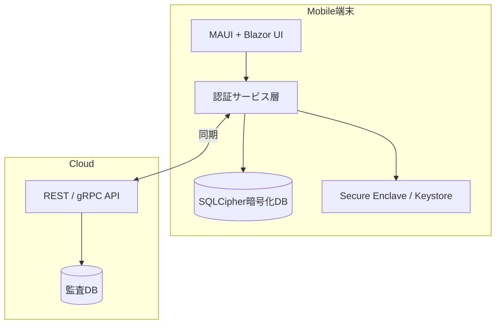

# Authenticator アプリ 要件定義書 v1

## 1. はじめに
- **文書目的**: 本書は、外部ベンダーに対してハイブリッド (Blazor + .NET MAUI) 実装の Authenticator モバイルアプリを発注する際の要件を明確化し、プロジェクトの成功に必要な共通理解を形成することを目的とする。
- **作成日**: 2025‑04‑21
- **作成者**: Mitsuo Koikawa（発注者代表）

## 2. 背景・目的
- 企業・個人向けサービスで用いる OTP (TOTP/HOTP) ベースの多要素認証を、**Android / iOS** 双方で提供。
- 各 OTP 利用時にクラウドへ利用ログを保存し、セキュリティ監査・利用分析を可能とする。
- **電波不良などオフライン環境**でも OTP 発行機能を確保し、オフライン中の利用ログを端末内に保管し、オンライン復帰時に安全に同期する。

## 3. 用語定義
| 用語 | 定義 |
|------|------|
| OTP | One Time Password (TOTP/HOTP) の総称 |
| ログ | アカウント ID, タイムスタンプ, アクション種別等を含む利用履歴 JSON |
| Secure Enclave / Keystore | 各 OS のハードウェア安全領域 |
| Blazor Hybrid | .NET MAUI に組み込む WebView‑ベースの UI 技術 |

## 4. システム概要

## 5. 対象プラットフォーム
| OS | 最低対応バージョン | アーキテクチャ | 配布形態 |
|----|--------------------|----------------|----------|
| Android | Android 8.0 (API 26) 以上 | ARM64 / x86‑64 | Google Play ストア配信 |
| iOS | iOS 15 以上 | ARM64 | App Store 配信 |

## 6. 機能要件
### F1. アカウント登録
- QR/URL 取込によるシークレット登録 (RFC 6238 / RFC 4226)
- サーバ側ユーザー ID と端末公開鍵のバインド (初回のみオンライン必須)

### F2. OTP 生成
- 30 秒周期 TOTP (デフォルト) ／ イベント駆動 HOTP (オプション)
- オフライン時も計算可能

### F3. オフライン利用ログ記録
- 端末内暗号化 DB に `{counter, timestamp, account_id, action}` を保存
- 各レコードを端末秘密鍵で電子署名

### F4. オンライン同期
- Play Integrity API / App Attest による端末健全性チェック
- 未送信ログ一括アップロード (再送制御／重複排除)
- 成功後、ローカルログに送信フラグ更新

### F5. 生体/PIN ローカル認証
- Android: BiometricPrompt
- iOS: LocalAuthentication (Face ID / Touch ID)

### F6. 端末セキュリティ
- ルート化・脱獄検知 → 制限モードまたは起動ブロック

### F7. バックアップ・機種変更
- 旧端末 → 新端末への鍵・アカウント移行 (端末間エンドツーエンド暗号化)

### F8. 多言語対応
- 日本語 / 英語 UI 切替 (リソースファイル運用)

## 7. 非機能要件
| 分類 | 要件 |
|------|------|
| 性能 | アプリ起動 < 2 秒 (コールド開始), OTP 生成 < 200 ms |
| バッテリー | 24 時間で追加消費 < 2 % |
| セキュリティ | OWASP MASVS L2 準拠, 端末鍵 256‑bit ECC, データ暗号化 AES‑256 GCM |
| アクセシビリティ | WCAG 2.1 AA 相当 |
| 可観測性 | クラッシュログ & カスタムイベントを Application Insights へ送信 |

## 8. 技術要件

### 8.1 言語 / フレームワーク
- **言語 / FW**: C# 12, .NET 8 (LTS), .NET MAUI 8, Blazor Hybrid

### 8.2 認証関連ライブラリ・SDK 選定
| カテゴリ | ライブラリ / SDK | ライセンス | 採用理由 |
|-----------|-----------------|------------|-----------|
| OTP 計算 | [Otp.NET](https://github.com/kspearrin/OTP.NET) | MIT | RFC 4226/6238 準拠、強力なテスト実績、MAUI で動作実績あり |
| 署名・暗号 | • **System.Security.Cryptography** (.NET 標準) • **BouncyCastle C#** • **libsodium‑net** (オプション) • **NSec.Cryptography** | MIT / BSD | HMAC‑SHA1/SHA‑256、AES‑GCM、ECDSA、Ed25519 等を提供。プラットフォームに依存せず暗号 API を統一 |
| ハードウェア鍵管理 | • Android **Keystore** + **Key Attestation** • iOS **Secure Enclave Keychain** • .NET MAUI `SecureStorage` 抽象化 | OS 依存 (標準利用) | 端末固有鍵生成・保護、鍵の持ち出し防止 |
| 端末健全性 / 改ざん検知 | • **Google Play Integrity API** (Android) • **Apple App Attest / DeviceCheck** (iOS) | Google / Apple 標準 | ルート化・脱獄・改造 APK 検出、Attestation Token 取得 |
| 生体認証 | • **MAUI Essentials** `BiometricAuthenticator` • **Plugin.Fingerprint** (補完) | MIT | Face ID / Touch ID / Android 生体 API を統一ラップ |
| FIDO2 (将来拡張) | **Fido2NetLib** | BSD‑3 | パスキー対応・WebAuthn サーバ実装と親和 |
| データベース | **SQLite‑net‑pcl** + **SQLCipher** | Public Domain / BSD | 軽量 DB + 256‑bit AES 全文暗号化 |
| QR 処理 | • **ZXing.Net.Maui** (スキャン) • **SkiaSharp** (描画) | Apache‑2.0 / MIT | 高性能、マルチプラットフォーム |

### 8.3 開発ツールチェイン & 品質管理
- **CI/CD**: GitHub Actions でマトリックスビルド (Android/iOS) ➜ App Center で内部配信 ➜ Store 提出
- **品質ゲート**: StyleCop + SonarCloud (Technical Debt < 5 %), テストカバレッジ 80 %以上
- **静的解析 / SAST**: GitHub Advanced Security + Grype (SBOM), Secrets Scanning
- **セキュリティテスト**: Mobile Security Framework (MobSF), OWASP Dependency‑Check

## 9. UI/UX 指針. UI/UX 指針
- MAUI Shell ナビゲーション
- ダーク/ライト テーマ自動切替
- 主要画面ワイヤーフレーム（別紙参照）

## 10.​ API 連携仕様 (概要)
| エンドポイント | メソッド | 認証 | 機能 |
|----------------|----------|------|------|
| `/v1/device/register` | POST | mTLS | 端末公開鍵登録 |
| `/v1/logs/batch` | POST | JWT (Device ID Claim) | 署名付ログ一括送信 |
| `/v1/device/attest` | POST | 無 | Play Integrity/App Attest トークン検証 |

※ 詳細パラメータ・レスポンス定義は API 仕様書で別途提示。

## 11. データベース設計 (端末内)
| テーブル | 主キー | 列 | 備考 |
|----------|--------|-----|------|
| `accounts` | `account_id` | name, secret, algorithm, digits | secret は Secure Enclave ラッパ参照 |
| `usage_logs` | `counter` | timestamp, account_id, action, signature, synced_flag | `counter` は単調増加 |

## 12. テスト要件
- **単体テスト**: xUnit, 500 ケース以上
- **UI テスト**: MAUI UITest + Appium, 主要フロー 100 %
- **セキュリティテスト**: MobSF 静的解析スコア 90 %以上、ペネトレーションテスト報告書
- **パフォーマンステスト**: 起動時間, バッテリー消費計測レポート

## 13. 納品物
1. ソースコード一式 (GitHub Private Repo)
2. ビルドスクリプト & CI/CD 設定
3. API クライアント・サーバ側モック
4. 技術設計書 / テスト仕様書 / 取扱説明書
5. ストア提出用パッケージ (AAB, IPA)
6. セキュリティテスト結果報告書

## 14. プロジェクト体制 & 役割分担
| 区分 | 発注者 | 受注者 (ベンダー) |
|------|--------|-------------------|
| PM | ○ | △ (共同管理) |
| 技術リード | ○ | ○ |
| 実装 |   | ○ |
| テスト | △ | ○ |
| ストア申請 | ○ | ○ |

## 15. スケジュール (案)
| フェーズ | 期間 | マイルストーン |
|----------|------|----------------|
| 要件定義確定 | ~2025‑05‑15 | 本書凍結 |
| 基本設計 | 2025‑05‑16 – 06‑15 | 画面遷移図・DB 設計完了 |
| 詳細設計 & 実装 | 2025‑06‑16 – 08‑31 | P1 機能完了 (内部 QA) |
| 総合テスト | 2025‑09‑01 – 09‑30 | 受入テスト合格 |
| ストア申請 | 2025‑10‑01 – 10‑15 | 各ストア審査通過 |
| 保守移行 | 2025‑10‑16 –  | 運用保守契約締結 |

## 16. 受入基準
- 全機能要件を満たす
- 非機能要件スコア達成
- 重大・高リスクバグ 0 件
- セキュリティ脆弱性 CVSS 7.0 以上 0 件

## 17. 支払条件 (例)
- 契約形態: 準委任 (アジャイル) + 成果物検収
- 支払: 月末締翌月末払い、マイルストーン達成時に検収

## 18. 参考・準拠資料
- RFC 6238 (TOTP), RFC 4226 (HOTP)
- OWASP Mobile Application Security Verification Standard (MASVS)
- Google Play Integrity API, Apple App Attest
- Microsoft .NET MAUI, Blazor 公式ドキュメント

---

> **備考**: 本書は初版です。要件確定後の変更は「変更管理プロセス」に従い双方合意のうえで進めます。

## 19. ライセンス・知的財産要件

### 19.1 プロダクトソースコード
- **権利帰属**: 受注者が実装した全ソースコード・ドキュメント・CI 設定ファイル等の著作権は、検収完了時点で発注者へ移転するものとする（全世界、期間無制限）。
- **利用許諾**: 発注者は商用・非商用を問わず二次利用・再配布・改変を行える専属的ライセンスを保有し、受注者は同コードを第三者へ再利用しない。
- ****ソース開示範囲**: クライアントアプリ（モバイル／デスクトップ）のソースコードを **Apache License 2.0** の下で OSS として公開するものとする。これにより利用者はソース閲覧・派生物作成の自由を持ちつつ、発注者および貢献者の特許がロイヤルティフリーでライセンスされ、商標不正使用が制限される。サーバサイドコードは非公開とし、別途商用ライセンス（プロプライエタリ）で管理する。

